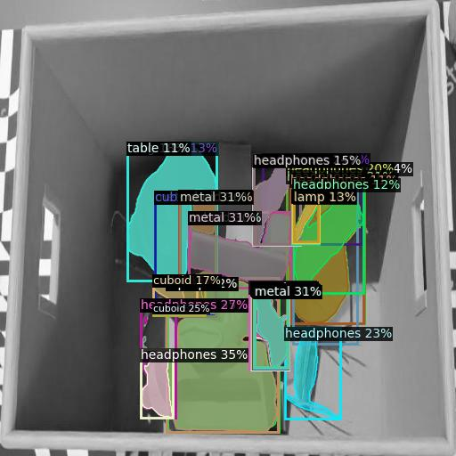
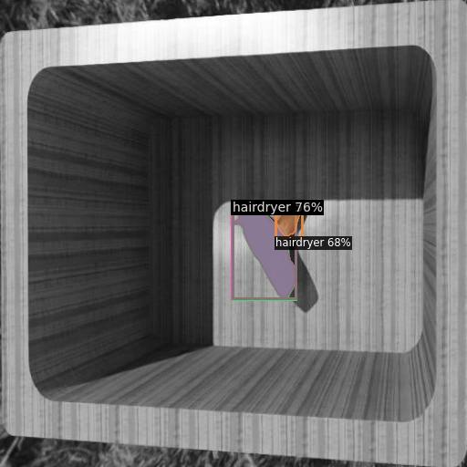

# OneFormer implementation for Instance segmentation on custom dataset.
<p align="center">
  
  
</p>


## Introduction
OneFormer is a universal image segmentation framework that unifies segmentation with a multi-task train-once design. Firstly, propose a task-conditioned joint training strategy that enables training on ground truths of each domain (semantic, instance, and panoptic segmentation) within a single multi-task training process. Secondly, it introduce a task token to condition the model on the task at hand, making model task-dynamic to support multi-task training and inference. OneFormer is a significant step towards making
image segmentation more universal and accessible. 
Git repository - https://github.com/SHI-Labs/OneFormer/tree/main

## Installation

- Python 3.8, PyTorch 1.10.1 (CUDA 11.3 build)
- natten 
```
pip3 install natten==0.14.6+torch1101cu113 -f https://shi-labs.com/natten/wheels
```
- Detectron2-v0.6
```
python -m pip install detectron2 -f https://dl.fbaipublicfiles.com/detectron2/wheels/cu113/torch1.10/index.html
```

## Prepare dataset
Make dataset in COCO format (annotations should be in [Object Detection](https://cocodataset.org/#format-data) format).
```
coco/
  annotations/
    instances_train2017.json
    instances_val2017.json
  train2017/
    # image files that are mentioned in the corresponding json
  val2017/
    # image files that are mentioned in the corresponding json
```

Name all the directories and .json files **exactly** how it was done in the example above.

## Change configuration files for metrics of your dataset. 

Navigate to config folder for coco data format, `OneFormer/configs/coco` , 
upadates in - `Base-COCO-UnifiedSegmentation.yaml` 

```
MODEL:
  WEIGHTS : /150_16_swin_l_oneformer_coco_100ep.pth
DATASETS:
  TRAIN: ("custom_train",)
  TEST_INSTANCE: ("custom_test",)
SOLVER:
  IMS_PER_BATCH: 1
  MAX_ITER: 24000
  STEPS: (21334, 23120)
INPUT:
  IMAGE_SIZE: 128
TEST:
  EVAL_PERIOD: 324
```
The above values are calculated based on number of instances. num_epochs set to `50`, sugnifies number of training epoch. To reduce the load on GPU batch size is reduced to 1. And rest of the calculation is as follows.  

```
MAX_ITER = num_epochs * training_samples / batch_size
MAX_ITER = 50 * 480 / 1 = 2400

STEPS = (0.89 * MAX_ITER, 0.96 * MAX_ITER)
STEPS = (21334, 23120)

WARMUP_ITERS = 5 (if MAX_ITER < 100000)
WARMUP_ITERS = 10 (otherwise)

EVAL_PERIOD = 0.0135 * MAX_ITER
EVAL_PERIOD = 324
```
Second file to update is, `oneformer_R50_bs16_50ep.yaml` , set the inference to only instance task.
```
MODEL: 
  TEST:
    SEMANTIC_ON: False
    INSTANCE_ON: True
    PANOPTIC_ON: False
    DETECTION_ON: False
    TASK: "instance"

TEST:
  DETECTIONS_PER_IMAGE: 100   #set number of detection expected 
```
Depending on the model weights loaded, within swin model `OneFormer/configs/coco/swin` make changes within ` oneformer_swin_large_bs16_100ep.yaml`.
```
SOLVER:
  IMS_PER_BATCH: 1
  BASE_LR: 0.001
  STEPS: (21334, 23120)
  MAX_ITER: 24000
  WARMUP_FACTOR: 1.0
  WARMUP_ITERS: 5
  WEIGHT_DECAY: 0.05
  OPTIMIZER: "ADAMW"
  BACKBONE_MULTIPLIER: 0.1
  CLIP_GRADIENTS:
    ENABLED: True
    CLIP_TYPE: "norm"
    CLIP_VALUE: 1.0
    NORM_TYPE: 2.0
```
## Pretrained Weights
- The downloaded pre-traiend weights must be palced in `weights` folder
- Pre-trained models can be downloaded following the instructions given [under tools](tools/README.md/#download-pretrained-weights).

### ADE20K

| Method | Backbone | Crop Size |  PQ   | AP   | mIoU <br> (s.s) | mIoU <br> (ms+flip) | #params | config | Checkpoint |
|   :---:| :---:    |  :---:    | :---: | :---:| :---:           | :---:               | :---:   |  :---: |    :---:   |
| OneFormer | Swin-L<sup>&dagger;</sup> | 640&times;640 | 49.8 | 35.9 | 57.0 | 57.7 | 219M | [config](configs/ade20k/swin/oneformer_swin_large_bs16_160k.yaml) | [model](https://shi-labs.com/projects/oneformer/ade20k/250_16_swin_l_oneformer_ade20k_160k.pth) |
| OneFormer | Swin-L<sup>&dagger;</sup> | 896&times;896 | 51.1 | 37.6 | 57.4 | 58.3 | 219M | [config](configs/ade20k/swin/oneformer_swin_large_bs16_160k_896x896.yaml) | [model](https://shi-labs.com/projects/oneformer/ade20k/896x896_250_16_swin_l_oneformer_ade20k_160k.pth) |
| OneFormer | Swin-L<sup>&dagger;</sup> | 1280&times;1280 | 51.4 | 37.8 | 57.0 | 57.7 | 219M | [config](configs/ade20k/swin/oneformer_swin_large_bs16_160k_1280x1280.yaml) | [model](https://shi-labs.com/projects/oneformer/ade20k/1280x1280_250_16_swin_l_oneformer_ade20k_160k.pth) |
| OneFormer | ConvNeXt-L<sup>&dagger;</sup> | 640&times;640 | 50.0 | 36.2 | 56.6 | 57.4 | 220M | [config](configs/ade20k/convnext/oneformer_convnext_large_bs16_160k.yaml) | [model](https://shi-labs.com/projects/oneformer/ade20k/250_16_convnext_l_oneformer_ade20k_160k.pth) |
| OneFormer | DiNAT-L<sup>&dagger;</sup> | 640&times;640 | 50.5 | 36.0 | 58.3 | 58.4 | 223M | [config](configs/ade20k/dinat/oneformer_dinat_large_bs16_160k.yaml) | [model](https://shi-labs.com/projects/oneformer/ade20k/250_16_dinat_l_oneformer_ade20k_160k.pth) |
| OneFormer | DiNAT-L<sup>&dagger;</sup> | 896&times;896 | 51.2 | 36.8 | 58.1 | 58.6 | 223M | [config](configs/ade20k/dinat/oneformer_dinat_large_bs16_160k_896x896.yaml) | [model](https://shi-labs.com/projects/oneformer/ade20k/896x896_250_16_dinat_l_oneformer_ade20k_160k.pth) |
| OneFormer | DiNAT-L<sup>&dagger;</sup> | 1280&times;1280 | 51.5 | 37.1 | 58.3 | 58.7 | 223M | [config](configs/ade20k/dinat/oneformer_dinat_large_bs16_160k_1280x1280.yaml) | [model](https://shi-labs.com/projects/oneformer/ade20k/1280x1280_250_16_dinat_l_oneformer_ade20k_160k.pth) |
| OneFormer (COCO-Pretrained) | DiNAT-L<sup>&dagger;</sup> | 1280&times;1280 | 53.4 | 40.2 | 58.4 | 58.8 | 223M | [config](configs/ade20k/dinat/coco_pretrain_oneformer_dinat_large_bs16_160k_1280x1280_coco_pretrain.yaml) | [model](https://shi-labs.com/projects/oneformer/ade20k/coco_pretrain_1280x1280_150_16_dinat_l_oneformer_ade20k_160k.pth) &#124; [pretrained](https://shi-labs.com/projects/oneformer/coco/150_16_dinat_l_oneformer_coco_100ep.pth) |
| OneFormer | ConvNeXt-XL<sup>&dagger;</sup> | 640&times;640 | 50.1 | 36.3 | 57.4 | 58.8 | 372M | [config](configs/ade20k/convnext/oneformer_convnext_xlarge_bs16_160k.yaml) | [model](https://shi-labs.com/projects/oneformer/ade20k/250_16_convnext_xl_oneformer_ade20k_160k.pth) |

### Cityscapes

| Method | Backbone |  PQ   | AP   | mIoU <br> (s.s) | mIoU <br> (ms+flip) | #params | config | Checkpoint |
|   :---:| :---:    | :---: | :---:| :---:      | :---:          | :---:   |  :---: |    :---:   |
| OneFormer | Swin-L<sup>&dagger;</sup> | 67.2 | 45.6 | 83.0 | 84.4 | 219M | [config](configs/cityscapes/swin/oneformer_swin_large_bs16_90k.yaml) | [model](https://shi-labs.com/projects/oneformer/cityscapes/250_16_swin_l_oneformer_cityscapes_90k.pth) |
| OneFormer | ConvNeXt-L<sup>&dagger;</sup> | 68.5 | 46.5 | 83.0 | 84.0 | 220M | [config](configs/cityscapes/convnext/oneformer_convnext_large_bs16_90k.yaml) | [model](https://shi-labs.com/projects/oneformer/cityscapes/250_16_convnext_l_oneformer_cityscapes_90k.pth) |
| OneFormer (Mapillary Vistas-Pretrained) | ConvNeXt-L<sup>&dagger;</sup> | 70.1 | 48.7 | 84.6 | 85.2 | 220M | [config](configs/cityscapes/convnext/mapillary_pretrain_oneformer_convnext_large_bs16_90k.yaml) | [model](https://shi-labs.com/projects/oneformer/cityscapes/mapillary_pretrain_250_16_convnext_l_oneformer_cityscapes_90k.pth) &#124; [pretrained](https://shi-labs.com/projects/oneformer/mapillary/mapillary_pretrain_250_16_convnext_l_oneformer_mapillary_300k.pth) |
| OneFormer | DiNAT-L<sup>&dagger;</sup> | 67.6 | 45.6 | 83.1 | 84.0 | 223M | [config](configs/cityscapes/dinat/oneformer_dinat_large_bs16_90k.yaml) | [model](https://shi-labs.com/projects/oneformer/cityscapes/250_16_dinat_l_oneformer_cityscapes_90k.pth) |
| OneFormer | ConvNeXt-XL<sup>&dagger;</sup> | 68.4 | 46.7 | 83.6 | 84.6 | 372M | [config](configs/cityscapes/convnext/oneformer_convnext_xlarge_bs16_90k.yaml) | [model](https://shi-labs.com/projects/oneformer/cityscapes/250_16_convnext_xl_oneformer_cityscapes_90k.pth) |
| OneFormer (Mapillary Vistas-Pretrained) | ConvNeXt-XL<sup>&dagger;</sup> | 69.7 | 48.9 | 84.5 | 85.8 | 372M | [config](configs/cityscapes/convnext/mapillary_pretrain_oneformer_convnext_xlarge_bs16_90k.yaml) | [model](https://shi-labs.com/projects/oneformer/cityscapes/mapillary_pretrain_250_16_convnext_xl_oneformer_cityscapes_90k.pth) &#124; [pretrained](https://shi-labs.com/projects/oneformer/mapillary/mapillary_pretrain_250_16_convnext_xl_oneformer_mapillary_300k.pth) |

### COCO

| Method | Backbone |  PQ   |  PQ<sup>Th</sup>   |  PQ<sup>St</sup>   | AP | mIoU | #params | config | Checkpoint |
|   :---:| :---:    | :---: | :---:              | :---:              |:---:| :---:| :---:  |  :---: |    :---:   |
| OneFormer | Swin-L<sup>&dagger;</sup> | 57.9 | 64.4 | 48.0 | 49.0 | 67.4 | 219M | [config](configs/coco/swin/oneformer_swin_large_bs16_100ep.yaml) | [model](https://shi-labs.com/projects/oneformer/coco/150_16_swin_l_oneformer_coco_100ep.pth) |
| OneFormer | DiNAT-L<sup>&dagger;</sup> | 58.0 | 64.3 | 48.4 | 49.2 | 68.1 | 223M | [config](configs/coco/dinat/oneformer_dinat_large_bs16_100ep.yaml) | [model](https://shi-labs.com/projects/oneformer/coco/150_16_dinat_l_oneformer_coco_100ep.pth) |

## Train 
To train the model, refer the code in `src/training_block.py ` make changes within the code, specify the path to json files, image data, config path and folder to save weights
Run `training_block.py` with corresponding configuration file like this:
```
cd src
python training_block.py
```
Logs, metrics and weights after training will be saved in new directory `scr/output`. (don't forget to clean it before, so new metrics won't overlap the old ones).

## Inference check
By default we are not using bounding boxes (”instance segmentation is not
object detection and thus does not require bbox predictions.”) for training part,
because generated boxes are very sensitive to outliers.

But bounding boxes can be extracted for inference. Make changes ` OneFormer/oneformer.py`

## Evaluation 
To evaluate the model,
```
cd src
python training_block.py --eval-only MODEL.WEIGHTS ../output_saved/model_final.pth ^C
```
mention the saved output path. 

evaluation metrics 
|  AP   |  AP50  |  AP75  |  APs  |  APm  |  APl  |
|:-----:|:------:|:------:|:-----:|:-----:|:-----:|
| 0.155 | 0.445  | 0.063  | 0.000 | 0.045 | 0.510 |

Here Average Precision (AP) is used for instance detection. 
Detailed over the evaluation matrix used is refer - https://cocodataset.org/#detection-eval

## Points to consider 

To tackle the issue of memory overflow during training, the image is resized and the detection head size is also reduce. This changes are reflected in the main code file. In file `src/training_block.py `

```

# Mention gradient clip 
cfg.SOLVER.CLIP_GRADIENTS.ENABLED = True
cfg.SOLVER.CLIP_GRADIENTS.CLIP_TYPE = "norm"
cfg.SOLVER.CLIP_GRADIENTS.CLIP_VALUE = 1.0
cfg.SOLVER.CLIP_GRADIENTS.NORM_TYPE = 2.0

# OneFormer 
cfg.MODEL.ONE_FORMER.HIDDEN_DIM = 128
cfg.MODEL.ONE_FORMER.NUM_OBJECT_QUERIES = 60
cfg.MODEL.ONE_FORMER.NUM_OBJECT_CTX = 8
cfg.MODEL.TEXT_ENCODER.WIDTH = 128

# Image resizing configuration
cfg.INPUT.MIN_SIZE_TRAIN = 128  # You can specify a list of sizes or a single value
cfg.INPUT.MAX_SIZE_TRAIN = 128
cfg.INPUT.MIN_SIZE_TEST = 128
cfg.INPUT.MAX_SIZE_TEST = 128

```

## Citation


```bibtex
@inproceedings{jain2023oneformer,
      title={{OneFormer: One Transformer to Rule Universal Image Segmentation}},
      author={Jitesh Jain and Jiachen Li and MangTik Chiu and Ali Hassani and Nikita Orlov and Humphrey Shi},
      journal={CVPR}, 
      year={2023}
    }
```

## Acknowledgement

We thank the authors of [Mask2Former](https://github.com/facebookresearch/Mask2Former), [GroupViT](https://github.com/NVlabs/GroupViT), and [Neighborhood Attention Transformer](https://github.com/SHI-Labs/Neighborhood-Attention-Transformer) for releasing their helpful codebases.


